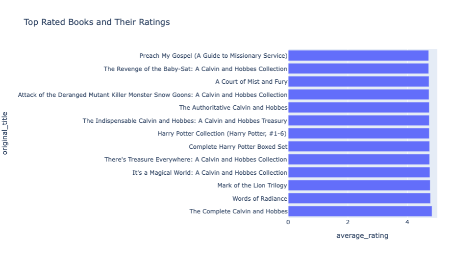
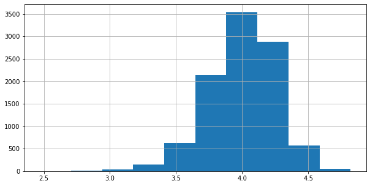
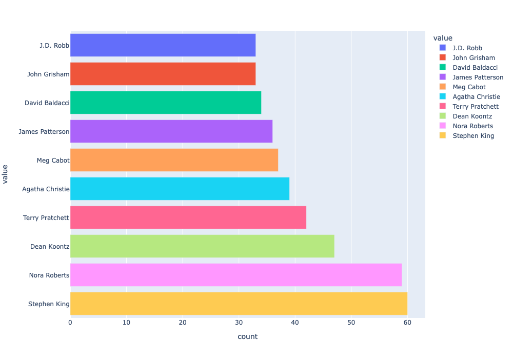
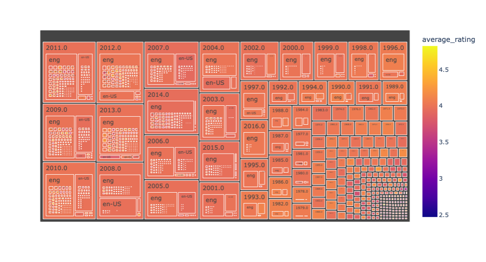
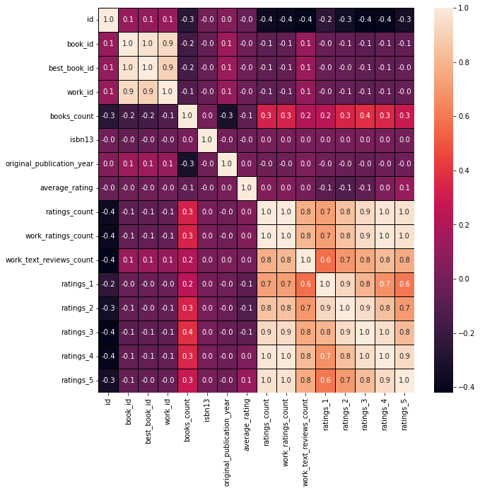
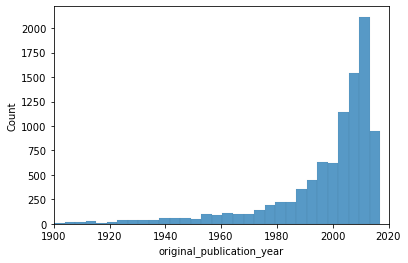
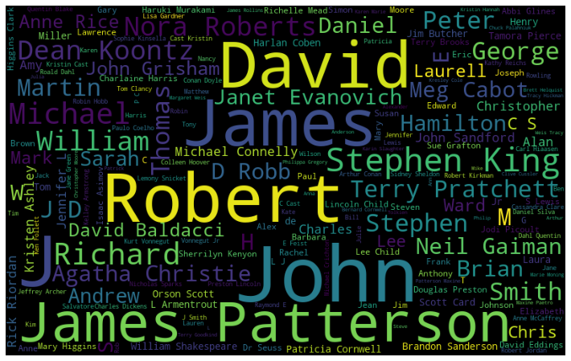

# CMPE-255 Team-12 Project - Book Recommendation System 

# Data Visualization
---------------------

### Top Rated Books

Observation: The above plot helps us to visualize 15 top rated books. Maximum rating of about 4.85

### Average Ratings Distribution
    
    Author : Vamsidhar
    
    This function takes in a dataframe and visualize Average ratings for the books in the dataset.
    
    Params:
    -------------------
    input: books_data
           =>dataframe
    -------------------
    
    output: Histogram to visualize Average ratings for the books in the dataset
    

### Top Authors

    Author : Vamsidhar
    
    This function takes in a dataframe and visualize Top Authors for the books in the dataset.
    
    Params:
    -------------------
    input: books_data
           =>dataframe
    -------------------
    
    output: Interactive Barplot to visualize top authors of books in the dataset
    

### Treemap
    Author : Vamsidhar
    
    This function takes in a dataframe and visualize dataset in form of Treemap.
    
    Params:
    -------------------
    input: books_data
           =>dataframe
    -------------------
    
    output: Treemap to visualize books in the dataset
    

### Heatmap
    Author : Vamsidhar
    
    This function takes in a dataframe and returns the correlation between all the columns.
    
    Params:
    -------------------
    input: books_data
           =>dataframe

### Number of books in each year
    Author : Vamsidhar
    
    This function takes in a dataframe and returns the histogram plot to visualize the number of books published each year.
    
    Params:
    -------------------
    input: books_data
           =>dataframe

### Number of Authors Ratings Rates
    Author : Vamsidhar
    
    This function takes in a dataframe and returns the Number of Authors Ratings Rates for year 2015 and 2016.
    
    Params:
    -------------------
    input: books_data
           =>dataframe

### Stopwords of Authors
    Author : Vamsidhar
    
    This function takes in a dataframe and returns the Stopwords of author.
    
    Params:
    -------------------
    input: books_data
           =>dataframe

