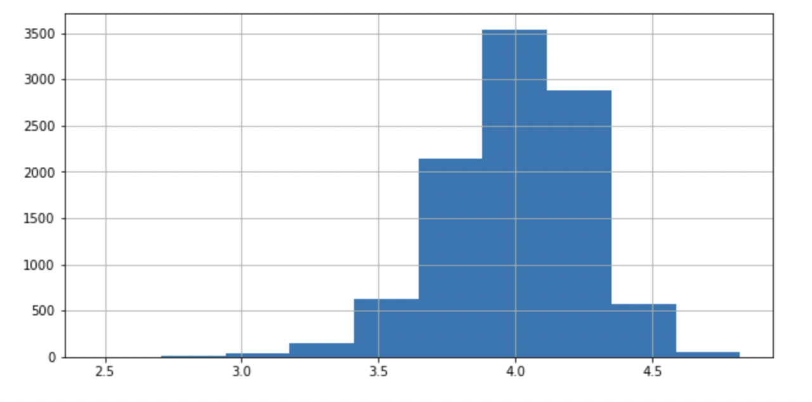
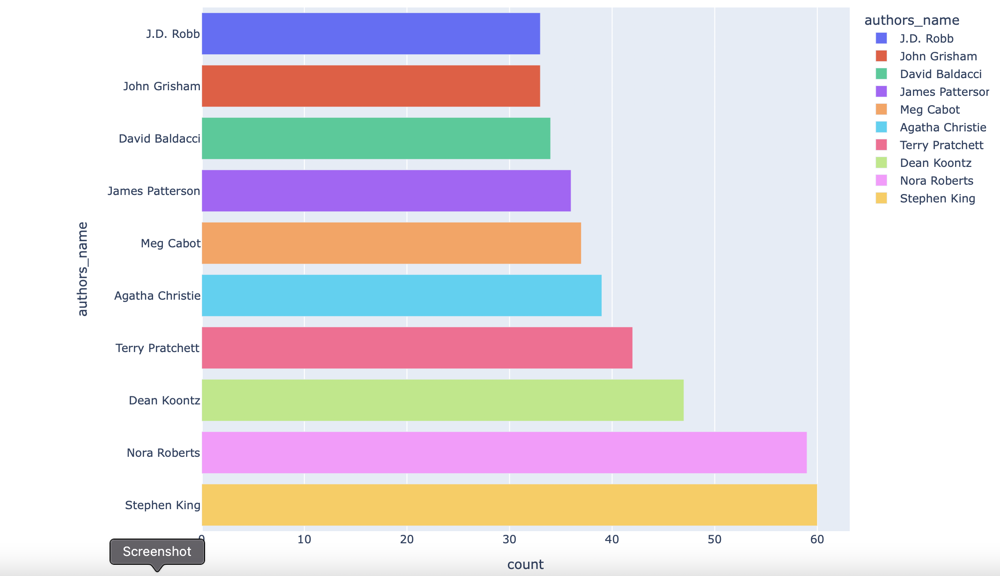
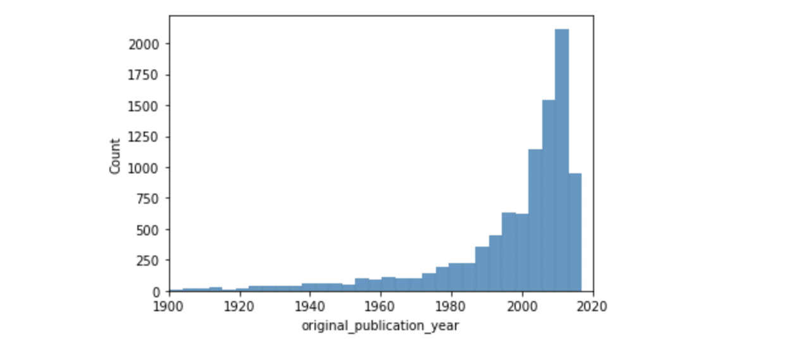
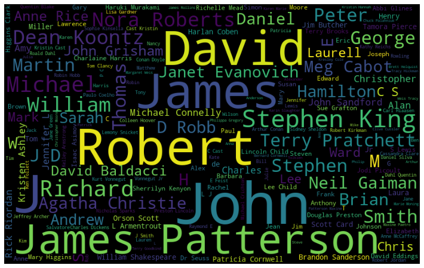

# CMPE-255 Team-12 Project - Book Recommendation System 

# Data Visualization
---------------------

### Top Rated Books

    
    

Observation: The above plot helps us to visualize 15 top rated books. Maximum rating of about 4.85

### Average Ratings Distribution
    
    
    

Observation: This visualize the Average ratings for the books in the dataset.

### Top Authors

    
    

Observation: This visualize Top Authors for the books in the dataset.

### Treemap
    
    

Observation: This visualize dataset in form of Treemap
### Heatmap
    

Observation: This will returns the correlation between all the columns

### Number of books in each year
   

Observation: The histogram plot to visualize the number of books published each year.

### Number of Authors Ratings Rates
    

Observation: The Number of Authors Ratings Rates for year 2015 and 2016.

### Stopwords of Authors
    

Observation: This will returns the Stopwords of author

