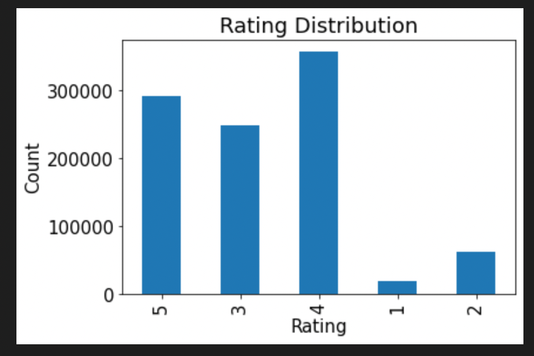
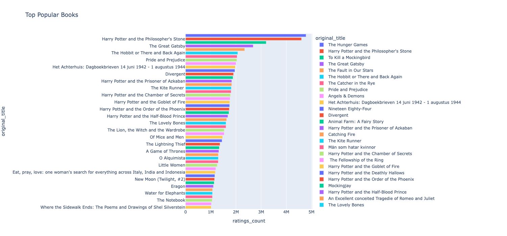
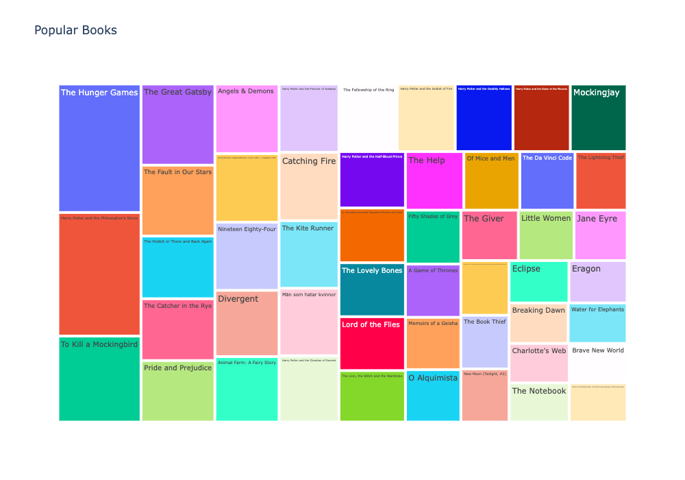
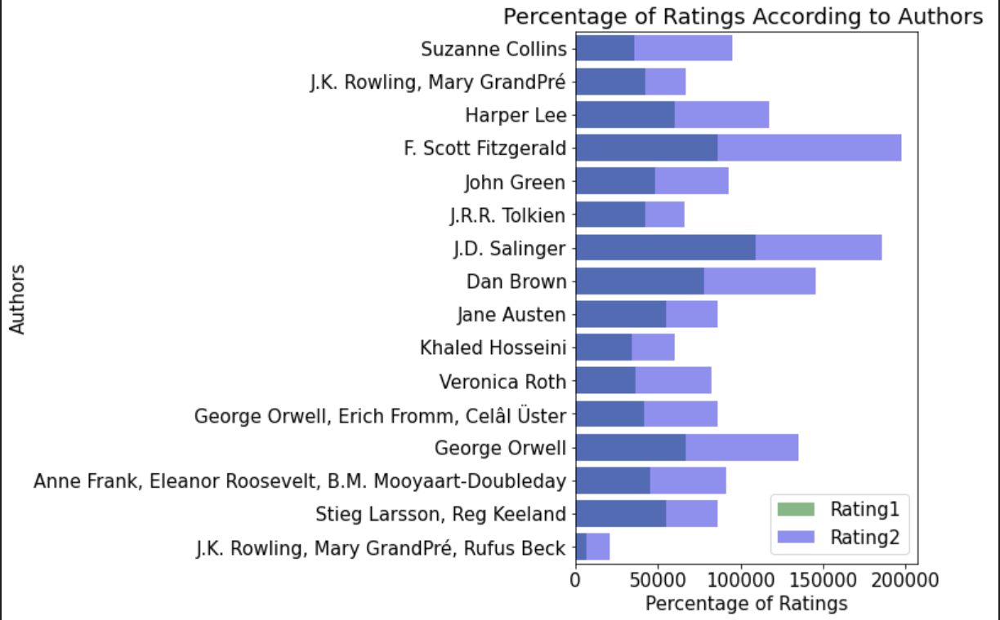
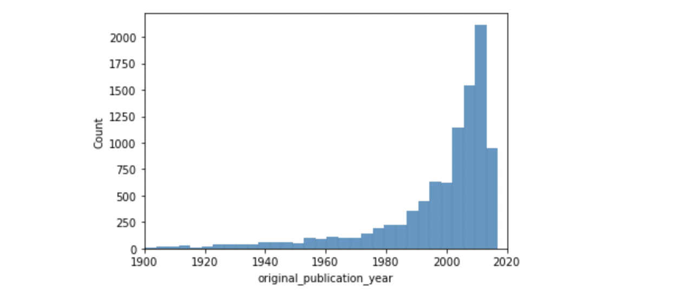
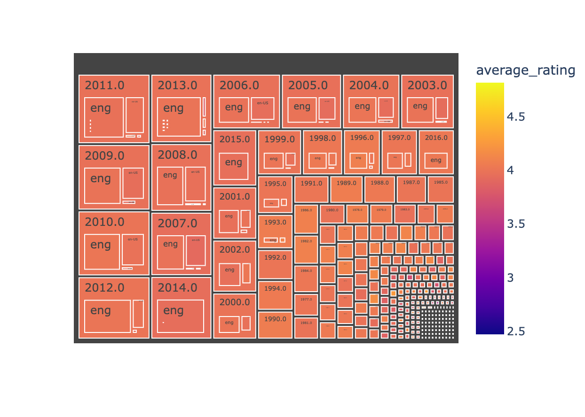
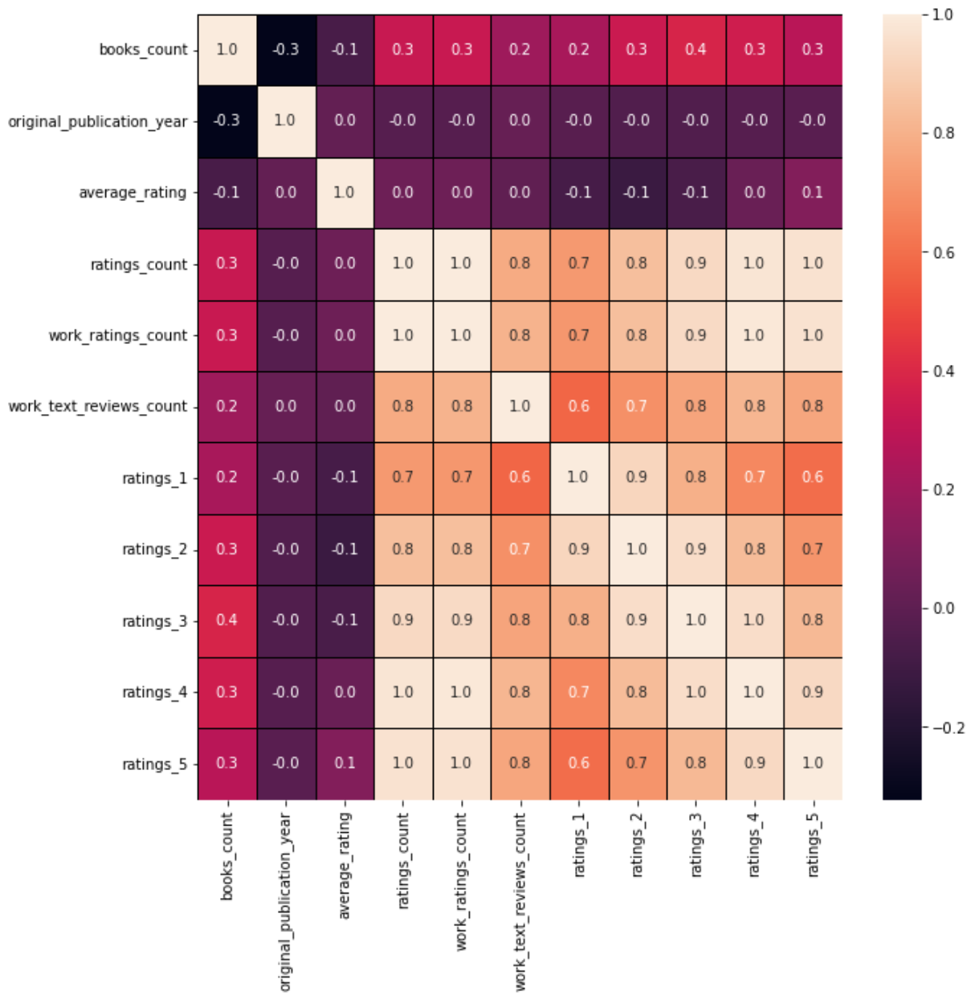

# CMPE-255 Team-12 Project - Book Recommendation System 

# Data Visualization
---------------------
A data visualization is a graphical representation of information and data.Visualizing data using charts, graphs, and maps makes it easier to see and understand trends, outliers, and patterns in data.

### 1.Ratings Distribution    
    
    

### 1.1 Top Rated Books
*****Observation*****: The below plot helps us to visualize 15 top rated books. Maximum rating of about 4.85
.There is a clear visual representation of top rated books according to the average ratings provided on X-axis, which ranges from 0-5 only.
    
    

## 1.2 Popular Book
*****Observation*****: The below plot helps us to visualize Popular Book in the dataset.

Treemap for Popularbooks

### 1.3 Best 15 books by Average rating

In the below bar graph, the bars are proportional to the values they represent, and the data is visualized using sns barplots. Average score has been taken on the X-axis and book title has been taken on the Y-axis. A visual representation of the bars is created by comparing both Average Score and book titles.

# 2. Authors

### 2.2 Authors with Most Books 

In the below bar graph, the bars are proportional to the values they represent, and the data is visualized using sns barplots. Number of Books has been taken on the X-axis and Author has been taken on the Y-axis. A visual representation of the bars is created by comparing both Number of books and Authors.

### 2.3 Top Authors

Interactive Barplot between count and the authors and visualized top authors of books in the dataset in the form of bar graph.

Treemap for authors

### 2.4  Percentage of Ratings According to Authors

Interactive Barplot between Percentage of Ratings and Authors and visulized the Percentage of Ratings According to Authors

### 2.5 Worldcloud of Authors

Creating string variables for authors and original_title, also creating a function to plot WordCloud()

Displaying most frequent words in author names

## 3. Number of books in each year

In the below histplot graphs, the bars are proportional to the values they represent, and the data is visualized using sns barplots. original_publication_year has been taken on the X-axis and Count has been taken on the Y-axis. A visual representation of the bars is created by comparing both original_publication_year and Counts.

## 4. Language

The books.csv contains information on the languages of the books, as you might have noticed.There are some books in other languages in the dataset.There are often multiple editions of a book (both in the same language and in different languages).According to this dataset, the most popular edition was included, which for some books is their original language.

Number of Books released in a specific Language (English included)

.png)

Number of Books released in a specific Language (English excluded)

.png)

## 5. Treemap
    
 The following treemap displays hierarchical data as nested rectangles. Each group is represented by a rectangle, whose area varies according to its    value.
 

## 6. Heatmap
    

