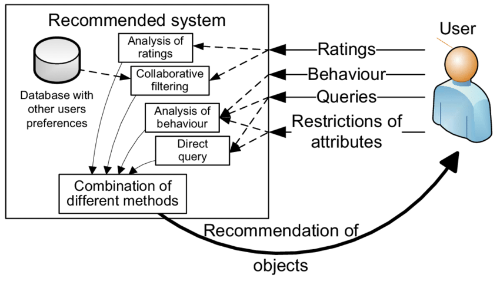
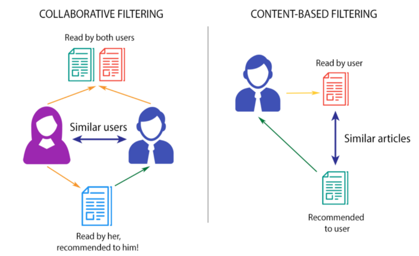
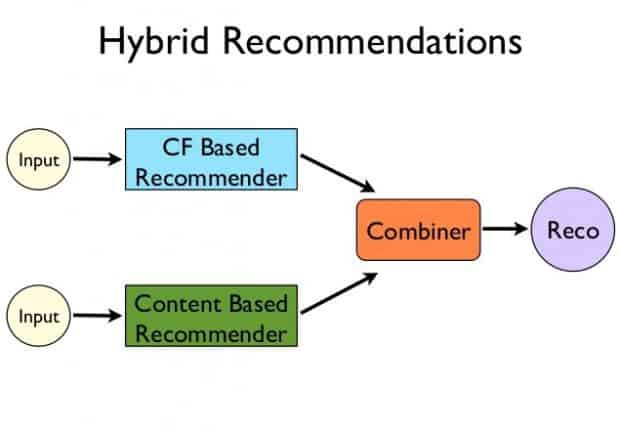
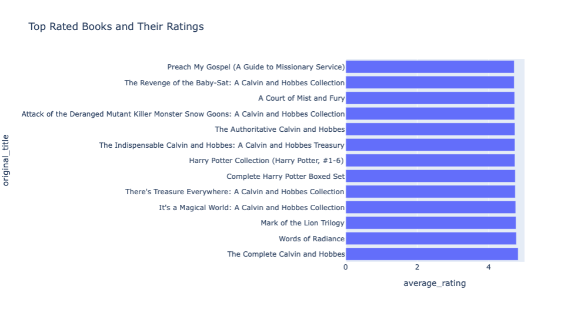

# Book Recommendation System

## Contents
- [Recommendation System](#recommendation-system)
- [Quick guide](#quick-guide)
- [Source Dataset](#source-dataset)
- [Project Overview](#project-overview)
- [Conclusion](#conclusion)


## Recommendation System


In today's society, when the internet has become an indispensable part of human existence, people are having difficulty deciding what to buy owing to the vast array of options. There is just too much data accessible on the internet while looking for everything from a hotel to decent investing possibilities. Companies have implemented recommendation systems to assist users in coping with this information deluge. Although there has been study in this field of recommendation systems for a long time, interest remains strong due to the variety of practical applications and the problem-rich sector. Recommender systems are used to make tailored suggestions based on the user's profile and past actions.

In the Internet industry, recommendation systems  are commonly employed by IT majors like Amazon, Netflix, and YouTube. Users can use recommendation systems to locate and pick goods such as clothes, books, movies and even food from a huge variety available on the internet or in other electronic information sources. They give the user with a limited collection of things that are well matched to the description from a big variety of goods and a description of the user's demands. A book recommendation system, on the other hand, gives a degree of comfort and personalisation that allows the user to connect more and read books that best suit their needs.

<!-- Start Changes Lavesh -->


## Quick guide

### Folder structure

```shell
Book_Recommendation_System/  
├── data
│   ├── book_tags_data.csv
│   ├── books_data.csv
│   ├── books_ratings_data.csv
│   └── tags_data.csv
├── data_preprocessing
│   ├── data_preprocessing_chetan_nain.ipynb
│   └── README.md
├── Data_visualization   
│   ├── Images
│   ├── Data-visualization.ipynb
│   ├── Data-visualization.py
│   └── README.md
├── Model
│   ├── images 
│   ├── Collaborative
│   │	├── Collaborative_Filtering_vamsidhar.ipynb
│   │	└── collaborative_Lavesh_Jain.ipynb
│   ├── Content_based
│   │	├── Content_Based_Chetan_Nain.ipynb
│   │	└── Content_Based_Recommodation_Vamsidhar.ipynb
│   ├── Hybrid
│   │	└── Hybrid_Lavesh_Jain.ipynb
│   └── README.md    
├── images
│   ├── Structure-of-a-recommender-system.png
│   ├── filtering.png
│   ├── hybrid.png
│   ├── recommend.png
│   └── customer_churn.jpeg
└── Paper
    ├── Images
    ├── paper.pdf
    ├── paper.md
    └── paper.bib  

```

## Source Dataset:
The dataset links: http://www2.informatik.uni-freiburg.de/~cziegler/BX/ | https://www.goodreads.com/api

### Books Table

| Feature Name | Type | Description |
| ------ | ------ |------ |
| id | Numerical | Id for the dataset |
| book_id | Numerical  | Id of each book |
| best_book_id | Numerical | Id of the latest version |
| work_id | Numerical | Abstract ID for the book|
| books_count | Numerical | Number of Edition|
| isbn | Numerical | The International Standard Book Number.|
| isbn13 | Numerical | 13 digit ISBN|
| authors | Text | Name of the Authors|
| original_publication_year | Numerical | Year of Publication of First Edition|
| original_title | Numerical | Title of Publication of First Edition|
| title | Text | Title of the Book|
| language_code | Text | Language the book is published in|
| average_rating | Numerical | Average ratings of the book|
| ratings_count | Numerical | Total counts of ratings given|
| work_ratings_count | Numerical | Total number of text reviews|
| work_text_reviews_count | Numerical | Total text reviews|
| ratings_1 | Numerical | Total number of 1 ratings given|
| ratings_2 | Numerical | Total number of 2 ratings given|
| ratings_3 | Numerical | Total number of 3 ratings given|
| ratings_4 | Numerical | Total number of 4 ratings given|
| ratings_5 | Numerical | Total number of 5 ratings given|
| image_url | Text | Image url to the book cover|
| small_image_url | Text | Small url to the book cover|

### Ratings Table

| Feature Name | Type | Description |
| ------ | ------ |------ |
| book_id | Numerical | Book Id for which rating is given |
| user_id | Numerical  | User Id who has given the data |
| rating | Numerical | Ratings given by the user|

### Book Tags Table

| Feature Name | Type | Description |
| ------ | ------ |------ |
| goodreads_book_id | Numerical | Good reads book Id |
| tag_id | Numerical  | Tag Id Associated |
| count | Numerical | Book_Rating|

### Tags Table

| Feature Name | Type | Description |
| ------ | ------ |------ |
| tag_id | Numerical  | Book_Number |
| tag_name | Text | Book_Rating|


## About Dataset

There are several ways to explore the dataset, including searching for which books you should read next (there are very few free content recommendation systems that recommend books last I checked), creating a word cloud based on the books you have read, and creating a list of books you want to read.

## Project Overview

Resources:

Programming language: Python 3.7,

Packages used: pandas, numpy, matplotlib, seaborn, sklearn, tensorflow.

## Project goal:

To build a recommendation system that will recommend a user top 5 books of his/her interest.

#### Project architecture:

**Exploratory data analysis (EDA):**
  - Visualization on some important parts like most rated books, most popular books, most popular authors, most number of ratings

**Data Preprocessing:**
  - Data cleansing
  - Nan value treatment
  - Extraction of relevant featuress
  
**Model building:**
  - Splitting data into train and test set
  - Neural Network creation(Using functional API)
  - Training on train data and validating on test data

**Recommendation:**
  - Loading model
  - Creating a function for recommendation

### Data Collection:

Download the dataset from [here]

<!-- End Changes Lavesh -->



Our system's main goal is to make book recommendations to its customers based on the ratings given by the user. The most common methods for offering recommendations to users are collaborative filtering and content-based filtering. Because of their unique qualities, both of them are best suited to certain circumstances. In this article, we adopted a hybrid method in which both algorithms complement each other, resulting in improved performance and accuracy for our system.


## Book Recommendation System 

Reading books doesn’t come easy to everyone. Especially, if you are not sure which book to read. Whether you will like one genre or not, or wondering if the book is even worth your time. We are working on the extensive field of recommendation systems and implementing them to suggest books according to readers’ interests.
A recommendation engine is a part of the machine learning domain that offers relevant suggestions to the customer. Such algorithms are a significant part of technology organizations like Amazon, Google, and Netflix. Applications like YouTube highly rely on recommendation systems for video suggestions so that the user sticks to their websites.
In our project we will be using a supervised learning algorithm to help readers select the next best possible book to read. We intend to solve the problem of selecting a book to read by giving readers suggestions based on their reading history. 


## Data Extraction:
Collecting the information of the books published and read over the world is a challenge in itself given the volume of data available. Goodreads is one of the popular websites among readers to review and rate the books they have read. For the purpose of this project, we are utilizing the API by Goodreads to collect the required data. The data consists of information about books like Title, Author, Date published, Genre, User ratings, Reviews, etc 
We are going to extract the data about the available books and store it in a csv file. We plan to preprocess and clean the data before carrying out any analysis on it. We assume the data to be noisy and incomplete. We are planning to use statistical data cleaning techniques like mean, median, etc to fill out the incomplete data. Techniques like box plot can be used to identify outliers.   

## Methodology: Hybrid Approch
Combination of Content-based & Collaborative filtering.



Recommendation systems can be divided into two categories: content-based and collaborative. In general, recommendation systems that use a content-based (CB) approach suggest things to a user that are comparable to those the user has previously favored. Collaborative filtering (CF) recommendation systems, on the other hand, forecast users' preferences by examining user relationships and item interdependencies and extrapolating new linkages from them. 

A hybrid recommender system is one that generates an output by combining different recommendation algorithms. When comparing hybrid recommender systems to collaborative or content-based systems, hybrid systems often have superior suggestion accuracy. The reason for this is a lack of knowledge about collaborative filtering's domain dependencies and people's preferences in a content-based system. When you combine the two, you get more common information, which helps you make better suggestions. Exploring novel ways to enhance core collaborative filtering algorithms with content data and content-based algorithms with user behavior data is especially intriguing as knowledge grows.




### 1. EDA:  

a) Loading the csv files

b) Checking the description of the daatsets like the data types, how many rows , columns, etc

c) Explored the following factors:

  - Top Rated Books
  
   ****Observation*****: The below plot helps us to visualize 15 top rated books. Maximum rating of about 4.85
   - There is a clear visual representation of top rated books according to the average ratings provided on X-axis, which ranges from 0-5 only.




  
  - Top Authors
  

  


### 2. Data visualization:


### 2.1 Worldcloud of Authors

Creating string variables for authors and original_title, also creating a function to plot WordCloud()

Displaying most frequent words in author names


### 3. Data Preprocessing:

Data preparation is the process of transforming raw data into an understandable format. We can't work with raw data, thus this is an important step in the data mining process. Make sure the data is of excellent quality before applying machine learning or data mining technologies.

Data preparation is used to guarantee that the data is of high quality. Quality may be determined using the following criteria:

Accuracy
Checking for completeness
Consistency
Updatable
Trustworthinessble
Data interpretability

In preprocessing we are doing five major steps:

1. Checking for null values and replacing with suitable values
2. Detecting Outliers
3. Organizing the data by getting it into proper format so that it can be used for analysis
4. Summary generation using google books api.
5. Clearning the dataset so that it can be used for model preparation.

For details on data preprocessing please visit [here](https://github.com/ChetanNain/CMPE-255-Final-Project/tree/main/data_preprocessing)

### 3. Model building:

In the project we are building a hybrid model which is to be built on collaborative filterning and content based to recommend the right book. The model is expected to give a better accuracy as it helps is getting the best of both the models.
It is evident that both the techniques are equally good and complement each other. We explored and studied recommendation technologies based on content filtering and user collaborative filtering and propose a hybrid recommendation algorithm based on content and user collaborative filtering. This method not only makes use of the advantages of content filtering but also can carry out similarity matching filtering for all items, especially when the items are not evaluated by any user, which can be filtered out and recommended to users, thus avoiding the problem of early level.

At the same time, this method also takes advantage of the advantages of collaborative filtering. When the number of users and evaluation levels are large, the user rating data matrix of collaborative filtering prediction will become relatively dense, which can reduce the sparsity of the matrix and make collab

### 4. Comparison:


### Collaborative vs Content Based 


### Collaborative Filtering


####  Memory Based
There are two types of Memory-Based Collaborative Filtering approaches: user-item filtering and item-item filtering. A user-item filtering algorithm takes a certain user, finds people who are similar to that user based on rating similarity, then recommends goods that those similar users enjoyed. Item-item filtering, on the other hand, will take an item and locate users who liked it, as well as other items that those users or similar users liked. It accepts products and generates recommendations for additional goods. In our algorithm we are using user-item approach rating data which we are mapping to other users trying to predict what they may like. 

#### Model Based
It is not necessary to recall the basis matrix while using model-based collaborative filtering. Instead, machine models are employed to anticipate and compute how each product is rated by a client. Machine learning is used in these system algorithms to anticipate unrated items based on user ratings. These algorithms are further classified as Matrix factorization-based techniques, deep learning methods, and clustering algorithms.
The simple cluster approach, similar to K-Nearest Neighbor, is typically used to discover the nearest embedding or neighbor consisting of a comparable matrix used for a product or a customer embedding. The matrix factorization approach is distinct from examining and studying the rate of rating matrix in an algebra setting, and it serves two purposes. First and foremost, the goal is to lower the dimension of the rating matrix. The second goal of this technique is to find perspective aspects under the grading matrix, which will result in various suggestions.


### Content Based Filtering


#### Sigmoid Kernel
A 'kernel technique' consists of two parts:
1. An embedding or feature space mapping
2. A learning technique for identifying linear patterns in that space

The identified patterns have a wide range of applications in pattern mining, clustering, classification, and other fields. More intelligent systems, such as recommendation engines and decision-making systems, can be created based on such first-level tasks. The mapping is known officially as a kernel function. It represents a similarity score between the data points in addition to mapping from non-linear space to linear space (like dot product).

The following are the major steps of a recommendation system:
1. get data 
2. prepare data (e.g. kernel-PCA for dimension reduction)
3. Using this data, determine who likes what and create a pattern; create a regression or classification model to represent the same - for example, SVM (a kernel method)
4. Create a ranking table based on some sort of similarity criteria (again a kernel function can be used as similarity metric).

#### Cosine Similarity
The cosine similarity scale runs from -1 to 1. 1 implies that the things are the same, but -1 indicates that the items are distinct. Even though the blue jet ski vector is larger than the orange one, the cosine similarity in example (b) is 1 (similar). This implies that cosine similarity is independent of vector magnitude or size. It is simply determined by the vectors' direction. The similarity increases as the angle between the vectors decreases.

In practical cases when determining the angle between two vectors is difficult, we may utilize the cosine formulation below, which is derived from the inner product of two vectors in linear algebra:


where a and b are the vectors of items a and b, and ||a|| and ||b|| are the vector's Euclidean norm or magnitude. This formula is better suited for machine learning applications where the vector values are known.


### Conclusion

#### The Hybrid Model
To get the best results we opted for Sigmoid based Content Recommendation and User-item based Collaborative filtering Method. The combination of two gave us the best results. With the two algorithm we were able to get the right recommendations.


To put it another way, it is only one of many, many techniques available, and it is actually rather straightforward. Nonetheless, I find the recommendations to be rather accurate and intriguing, so it is a strategy that works well and is, computationally speaking, extremely inexpensive!

Lastly we did a thorough testing but keeping the project deadlines we relied mostly on Human interpretation and did a thorough testing. We also calculated the error in our algorithm and made tweeks so as to get maximum accuracy percentage. 
Human Interpretation: Human interpretation is required to ensure that the recommender does not merely recommend popular things to the user.
Mean Absolute Error: In a model-based recommender system, this is the average of the difference between actual and anticipated values.
Mean Squared Error: Mean Squared Error, like MAE, accounts for the negative sign by squaring the predictions.
The average resemblance of all recommended items to a user is referred to as intra-list similarity.
Personalization: It is also critical to consider how individualized the recommendations are.


### Contributers

| Name | Id | GitHub User Name  |
| ------ | ------ | ------ |
| Chetan Nain | 015761122 | ChetanNain |
| Lavesh Jain | 015017145  | Laveshjain11 |
| Vamsidhar Reddy Menthem | 015999191 | vamsidhar18 |
